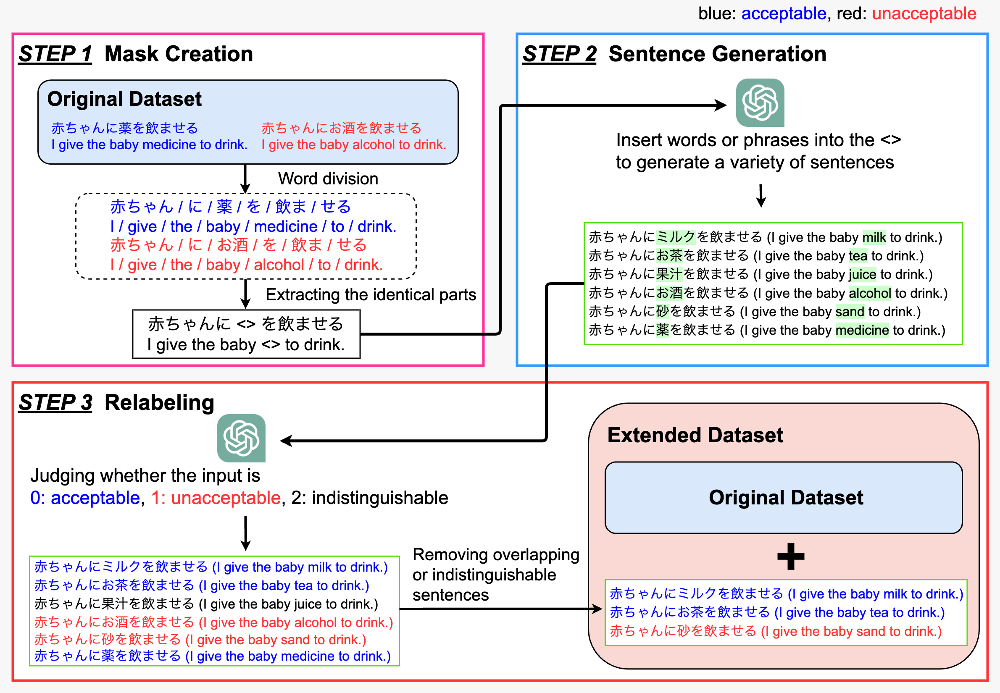

# Extended JCM (eJCM)
[](https://arxiv.org/abs/2410.09564)
[](https://dl.acm.org/doi/10.1145/3627673.3679924)

This dataset is an extension of [**JCommonsenseMorality**](https://github.com/Language-Media-Lab/commonsense-moral-ja), a dataset that reflects Japanese commonsense morality.


## Method: Masked Token and Label Enhancement (MTLE)
We designed MTLE to augment datasets consisting of sentences whose labels change according to changes in situations or actions.
MTLE consists of three steps: mask creation, sentence generation, and relabeling.
We have extended the existing JCM dataset using MTLE to generate the Extended JCM (eJCM) dataset.

### 1) Mask Creation
We tokenize sentence pairs, extract the longest common **prefix** and **suffix**, and insert `<>` between them to form a **mask sentence**. Masks shorter than 6 characters (including `<>`) are discarded.

### 2) Sentence Generation
For each mask, an LLM replaces `<>` and returns six sentences—three morally **acceptable** and three **unacceptable**. 

### 3) Relabeling
The LLM labels each sentence as **0 = acceptable**, **1 = unacceptable**, or **2 = indistinguishable** (to filter strange or morally ambiguous cases). Duplicates with the original or other sentences are removed. We keep up to three acceptable and up to three unacceptable sentences per source to reduce label bias.

<p align="center">
  
</p>

## Usage
### Installation
``` bash
$ git clone git@github.com:IyatomiLab/extended-jcm.git
$ cd extended-jcm

$ pip install -U pip setuptools poetry
$ poetry install
```

### Step1: Mask Creation & Step2: Sentence Generation
```
poetry run python mtle/generate.py \
  -i data/original_data.csv \
  -o data/generated_data.csv \
  --start 0 \
  --retries 3 \
  --model gpt-4o-mini \
  --timeout 30 \
  --ckpt-every 20
```

### Step3: Relabeling (0/1/2)
```
poetry run python mtle/relabel.py \
  -i data/generated_data.csv \
  -o data/relabeled_data.csv \
  --start 0 \
  --model gpt-4o-mini \
  --timeout 30 \
  --ckpt-every 20
```

### Merge generated data into the original dataset
```
poetry run python mtle/augment_dataset.py \
  -i data/relabeled_data.csv \
  -o data/extended_data.csv
```


## Citation
``` bibtex
@inproceedings{ohashi2024mtle,
  author = {Ohashi, Takumi and Nakagawa, Tsubasa and Iyatomi, Hitoshi},
  title = {Extended Japanese Commonsense Morality Dataset with Masked Token and Label Enhancement},
  booktitle = {Proceedings of the 33rd ACM International Conference on Information and Knowledge Management},
  year = {2024},
  publisher = {Association for Computing Machinery},
  doi = {10.1145/3627673.3679924},
}
```

## References
- 竹下昌志, ジェプカ・ラファウ, 荒木健治. JCommonsenseMorality:常識道徳の理解度評価用日本語データセット. 言語処理学会第29回年次大会, pp.357-362, March 2023. [[PDF]](https://www.anlp.jp/proceedings/annual_meeting/2023/pdf_dir/D2-1.pdf)